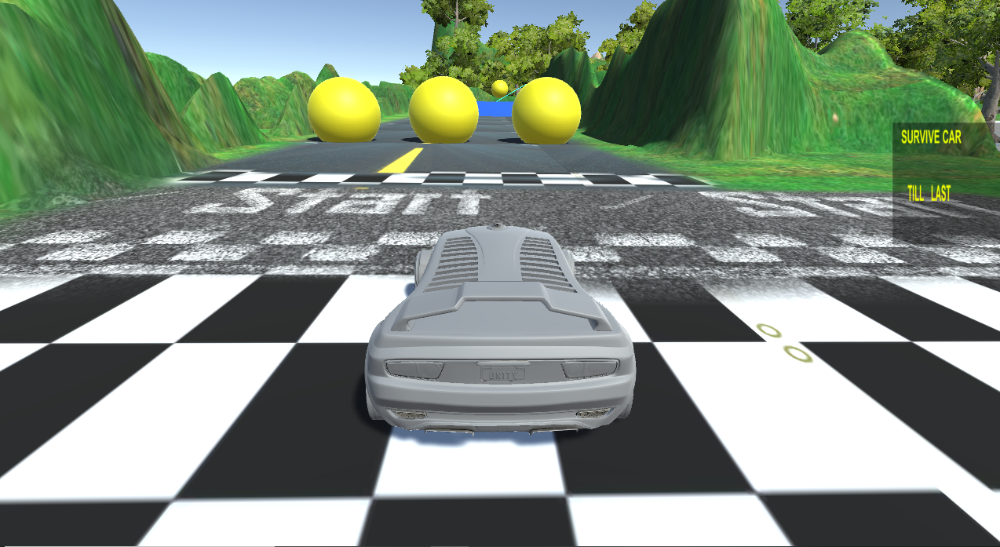

# Racing-Game-Unity

<b> It's a racing game made in Unity Version 17 </b>

 

 It consists of 2 Rar (Data + GameUnity) , extract files of both into a single folder and then run the .exe file of the game to play it
  

 
Many bugs are there but its a simple example of games that can be made with unity.
